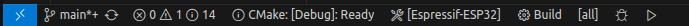

```
       __  __ _  __                                
      |  \/  | |/ /                                
   ___| \  / | ' / __ _                            
  / _ \ |\/| |  < / _` |                           
 |  __/ |  | | . \ (_| |                           
  \___|_|  |_|_|\_\__,_|               _ _         
      | |    | |  | |                 (_) |        
   ___| | ___| | _| |_ _ __ ___  _ __  _| | ____ _ 
  / _ \ |/ _ \ |/ / __| '__/ _ \| '_ \| | |/ / _` |
 |  __/ |  __/   <| |_| | | (_) | | | | |   < (_| |
  \___|_|\___|_|\_\\__|_|  \___/|_| |_|_|_|\_\__,_|
                                                   
```
# vsc-esp32
Visual Studio Code - ESP32 Template Project

It isn't any custom tool for VS Code. It's just simple CMake tools configuration ;)

## The goal...
...is to provide an ultra-simple and elegant template to develop ESP32-based projects within Visual Studio Code **WITHOUT** any strange plugins!  
The only plugin that is actually needed is the [C/C++ extension pack](https://marketplace.visualstudio.com/items?itemName=ms-vscode.cpptools-extension-pack)

* No manual headers path adding
* Automatic re-configuration when SDK-config or CMakeLists.txt files changes
* Correct syntax highlighting, code navigation and preprocessor conditional statements dimming!

The application that is used here is a simple hello world app copied from idf examples.

## 0. Quick way
if You're sure that You have all dependencies... For details, follow from [1. Get started](#1-Get-started)  

In terminal:
```
git submodule update --init --recursive && \
./lib/esp-idf/install.sh && \
code .
```
In VS Code:

1. Select kit :: Hit F1 and type **CMake: Select a Kit**
2. Configure project :: Hit F1 and type **CMake: Configure**
3. Build the project :: Hit F1 and type **CMake: Build**


## 1. Get started!

### 1.1 What do we need?

* Linux-based host OS (Ubuntu 22.04 LTS in my case)  
    *Not tested under windows but it might work with some insignificant modifications*
* [Cmake](https://cmake.org/) > 3.16
    ```
    sudo apt install CMake
    ```
* [Visual Studio Code](https://code.visualstudio.com/) obviously... ;)  
* ...and the [C/C++ extension pack](https://marketplace.visualstudio.com/items?itemName=ms-vscode.cpptools-extension-pack)
* [Ninja](https://ninja-build.org/) or [Make](https://www.gnu.org/software/make/)
    ```
    sudo apt install ninja-build
    ```
    or
    ```
    sudo apt install make
    ```

    But these packages should be installed as the espressif toolchain dependencies. 

### 1.2 Get the esp-idf!

The esp-idf repository is a git submodule of this project, located under lib/ directory. The main pron of keeping esp-idf as a submodule is a fixed commit hash which brings independence from ongoing esp-idf updates. Whenever we want to stay up to date with the esp-idf we can simply manually checkout to the most recent version (or whatever version we want :] )

So...
```
git submodule update --init --recursive
```

Or if You want to keep the idf repository elsewhere, it is up to You...

### 1.3 Espressif toolchain installation
After all submodules are cloned and checked out we can call
```
./lib/esp-idf/install.sh
```

**NOTE!**  
During Espressif toolchain installation there might be some additional dependencies missing like python-venv etc. that have to be installed!

## Setting up VSC
**NOTE!**  
I assume that You've already install Visual studio code and the C/C++ extension pack...

The whole magic is actually a very simple workspace configuration under **.vscode** directory

### Cmake kits

The [CMake Kits](https://vector-of-bool.github.io/docs/vscode-cmake-tools/kits.html) are set up in the [.vscode/cmake-kits.json](.vscode/cmake-kits.json) file.

For the purpose of this template i've created a few kits named
* **Espressif-ESP32** - For common ESP32 targets
* **Espressif-ESP32s2** - For ESP32s2 targets
* **Espressif-ESP32s3** - For ESP32s3 targets

Analogically, there might be more kits for f.e. RISC-V architecture etc...

The example kit configuration:

```json
    {
        "name": "Espressif-ESP32",
        "description": "ESP32 CMake kit",
        "compilers": {
            "CC" : "${userHome}/.espressif/tools/xtensa-esp32-elf/esp-12.2.0_20230208/xtensa-esp32-elf/bin/xtensa-esp32-elf-gcc",
            "CXX" : "${userHome}/.espressif/tools/xtensa-esp32-elf/esp-12.2.0_20230208/xtensa-esp32-elf/bin/xtensa-esp32-elf-g++"
        },
        "environmentSetupScript": "${workspaceFolder}/lib/esp-idf/export.sh"
    }
```

The compiler's paths must match the actual location on your PC. If You are using a different version and/or location of esp-idf repository, make sure the paths in the kits are OK!

The **environmentSetupScript** is a path to a script that will be sourced by the shell before the VSC will configure the project with CMake. As well known the export.sh from esp-idf has to be sourced before building the project...

### Workspace settings

The [.vscode/settings.json](.vscode/settings.json) file contains the following options:

* **"C_Cpp.default.configurationProvider": "ms-vscode.cmake-tools"**

    This is one of the most important settings because it tells the VS Code intellisense engine to make use of CMake cache to correctly manage used compile time definitions, headers search paths, etc...

* (Not mandatory) **"cmake.buildDirectory": "${workspaceFolder}/build"**

    ${workspaceFolder}/build is the default path but You can specify it to any place You wish the build directory should be created.

* (Not mandatory) **"cmake.generator": "Ninja"**

    This option tells the CMake to use Ninja as the underlying build system

### Additional configuration

TODO:
* [CMake Variants](https://vector-of-bool.github.io/docs/vscode-cmake-tools/variants.html) - A set of options passed to CMake during configuration  
* Unit test framework

## Configuring and building!

Now when everything is set up we can simply click the build button at the bottom CMake toolbar and enjoy the perfectly configured environment for the ESP32 development!



* CMake:[Debug]:Ready --> variant selection button
* Build --> Build button
* [all] --> Software component to be built. Default to all but we can select f.e bootloader only, etc...

The "Debug" and "Run" buttons are useless for cross-compiled targets but they will be quite handy for unit-tests build!